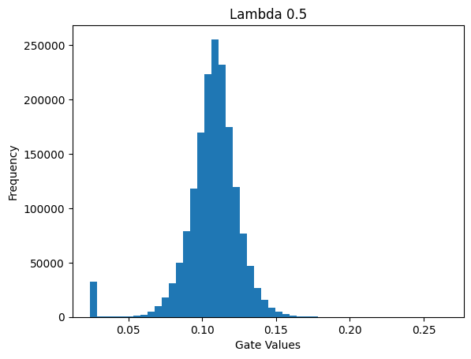
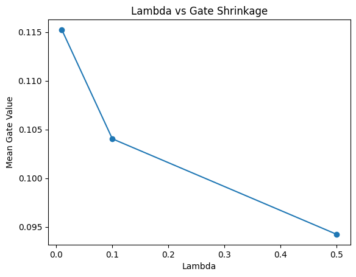
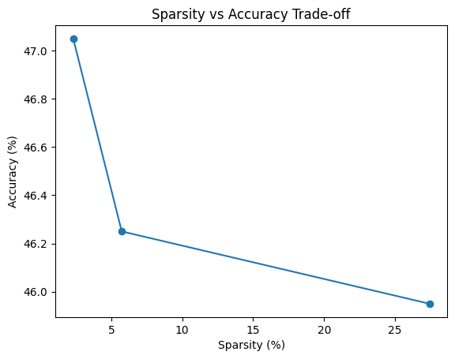

# Self-Pruning Neural Network

A neural network that learns to **prune its own weights during training** using learnable gates and L1 regularization.

---

##  Overview

This project implements a neural network that can automatically identify and suppress unnecessary connections while training.

Instead of pruning weights after training, the model learns which weights are important and gradually reduces the influence of less useful ones. This is done using a gating mechanism attached to every weight.

---

##  How It Works

Each weight in the network has an associated **gate value** between 0 and 1.

- Gate ≈ 1 → weight is active  
- Gate ≈ 0 → weight is effectively removed  

The gate is learned during training using a sigmoid function applied to a parameter called `gate_score`.

During the forward pass:

effective_weight = weight × sigmoid(gate_score)

---

##  Model Architecture

A simple fully connected network is used:

Input (3072) → 512 → 256 → 10

- Activation: ReLU  
- Dataset: CIFAR-10 (subset used for faster training)

---

##  Training Objective

The model is trained using a combination of:

Total Loss = CrossEntropyLoss + λ × SparsityLoss

- CrossEntropyLoss → ensures good classification performance  
- SparsityLoss (L1 on gates) → encourages gates to shrink toward zero  

This allows the network to learn which connections to keep and which to suppress.

---

##  Results

| Lambda | Accuracy | Sparsity |
|--------|---------|----------|
| 0.01   | 47.05%  | 2.31%    |
| 0.1    | 46.25%  | 5.73%    |
| 0.5    | 45.95%  | 27.43%   |

---

##  Observations

- Increasing λ increases sparsity  
- The model gradually suppresses less important connections  
- Moderate pruning does not significantly affect accuracy  
- Higher pruning levels lead to some performance drop  

---

##  Visualizations

### Gate Distribution (example for higher λ)

### Lambda vs Gate Shrinkage

### Sparsity vs Accuracy Trade-off

---

##  Key Takeaways

- The model successfully learns to prune itself during training  
- Sparsity emerges gradually, not abruptly  
- Pruning behaves like a regularization technique  
- There is a trade-off between sparsity and performance  

---

##  Limitations

- Gates do not become exactly zero due to sigmoid behavior  
- Sparsity depends on the chosen threshold  
- More training could further increase sparsity  

---
